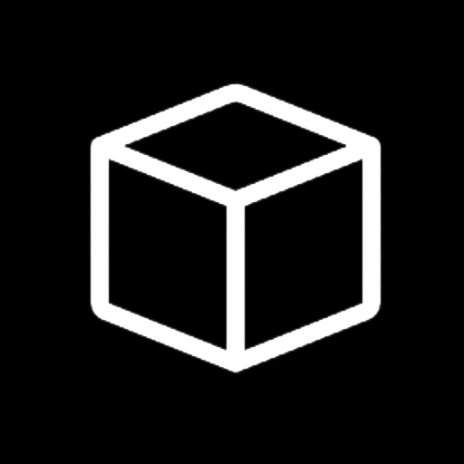

# DarkBox: A Platform for Project Hosting & Developer Collaboration

<p align="center">
  
</p>

### 🚀 **About DarkBox**
DarkBox is a platform designed for **hosting programming projects** and **connecting clients with freelance developers**. Inspired by GitHub, it allows developers to collaborate on open-source projects and get hired by clients to complete specific tasks.

---

### 💡 **Features**
- **Project Hosting:** Host your own code repositories and share them with the community.
- **Job Board:** Clients can post project requests for developers to work on.
- **Collaboration Tools:** Find other developers for collaborative work on projects.
- **Verified Developers:** A special role for verified programmers who have passed a selection process.

---

### 🔧 **Technologies Used**
- **Frontend:** Bootstrap (for responsive and modern UI)
- **Backend:** ASP.NET (for building robust web applications)
- **Database:** SQL Server (for data storage and management)

---

### 📋 **How to Contribute**
1. Fork the repository
2. Clone your forked repo
3. Create a new branch (`git checkout -b feature-branch`)
4. Commit your changes (`git commit -m 'Add new feature'`)
5. Push to the branch (`git push origin feature-branch`)
6. Open a pull request to the main repository

---

### ⚙ **How to Get Started**

1. Clone the repository:
   ```bash
   git clone https://github.com/DeepDish36/darkbox.git

2. Install dependencies (ASP.NET, SQL Server setup, etc.)

3. Start the application:
    ```bash
    dotnet run

### 🎨 **Contributors**
- Gomes (Creator of DarkBox)
- Want to be a contributor? Contact me
  
### 📞 **Contact Us**
For more information, please contact me via email at andredeepgomes@gmail.com.

### 🔗 **Follow Us on Social Media**
- [Discord](discord.com)
