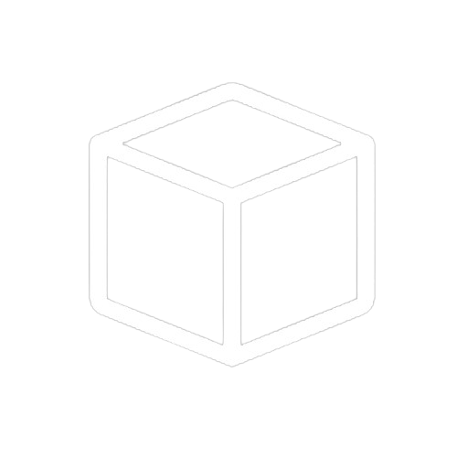

# DarkBox: A Platform for Project Hosting & Developer Collaboration

<p align="center">
  
</p>

### 🚀 **About DarkBox**
DarkBox is a platform designed for **hosting programming projects** and **connecting clients with freelance developers**. Inspired by GitHub, it allows developers to collaborate on open-source projects and get hired by clients to complete specific tasks.

---

### 💡 **Features**
- **Project Hosting:** Host your own code repositories and share them with the community.
- **Job Board:** Clients can post project requests for developers to work on.
- **Collaboration Tools:** Find other developers for collaborative work on projects.
- **Verified Developers:** A special role for verified programmers who have passed a selection process.

---

### 🔧 **Technologies Used**
- **Frontend:** Bootstrap (for responsive and modern UI)
- **Backend:** ASP.NET (for building robust web applications)
- **Database:** SQL Server (for data storage and management)

---

### 📋 **How to Contribute**
1. Fork the repository
2. Clone your forked repo
3. Create a new branch (`git checkout -b feature-branch`)
4. Commit your changes (`git commit -m 'Add new feature'`)
5. Push to the branch (`git push origin feature-branch`)
6. Open a pull request to the main repository

---

### ⚙ **How to Get Started**

1. Clone the repository:
   ```bash
   git clone https://github.com/DeepDish36/darkbox.git
   ```
2. Install dependencies
    ```
    (ASP.NET, SQL Server setup, etc.)
    ```
5. Start the application:
    ```bash
    dotnet run
    ```
---

### 🎨 **Contributors**
- Gomes (Creator of DarkBox)
- Want your name on this list? Contribute now 

---

### 🤝 **How to Contribute or Collaborate**
If you're interested in contributing to DarkBox or would like to collaborate in the future, feel free to reach out to me directly! You can contact me through:

- **Email**: andredeepgomes@gmail.com
- **GitHub Issues**: Feel free to open an issue for suggestions or collaboration ideas.
- **Discord**: Join our [server](https://discord.gg/kQEKP7G5) and reach out in the `#collaborations` channel.

Every contribution, big or small, is highly appreciated!

---
  
### 📞 **Contact Us**
For more information, please contact me via email at andredeepgomes@gmail.com.

---

### 🔗 **Follow Us on Social Media**
- [Discord (in development)](https://discord.gg/kQEKP7G5)

<br>
If you liked it, don't forget to leave a ⭐ in the repository!
<br>
<div align="right">Made by: The DarkBox Team © | In 2025</div>
